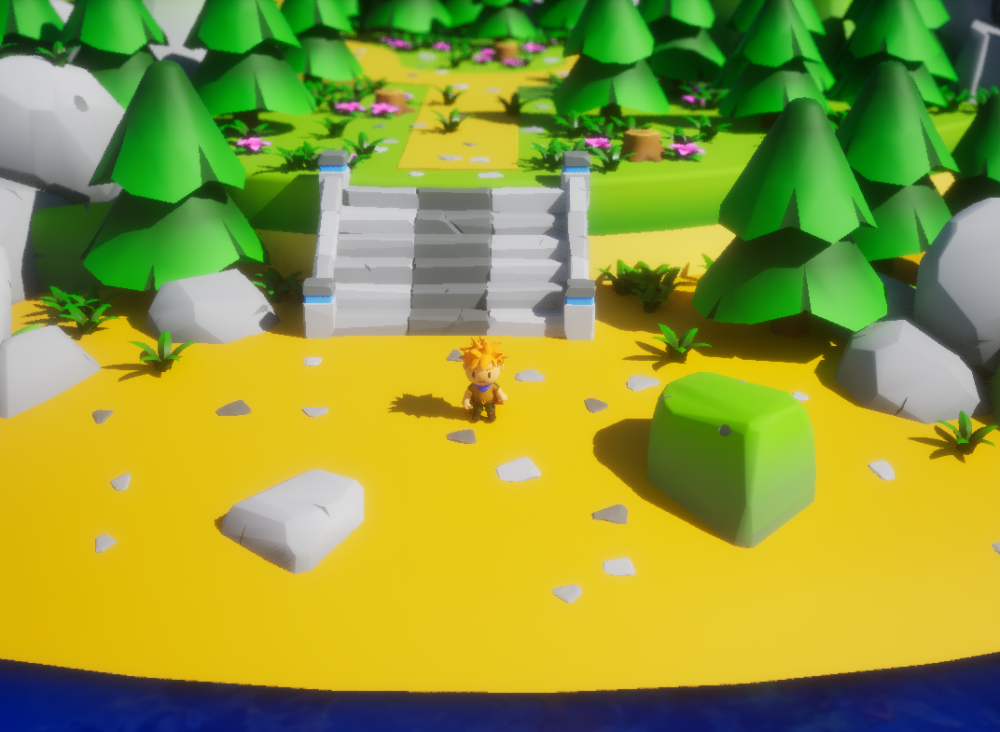

# Tale

「Tall Tale」または「Tale」は、Unreal Engine 5を使用して開発されたシングルプレイヤー向けアクションアドベンチャーゲームです。このゲームは、中世をモチーフにしたファンタジー世界を舞台に、多様なモンスターが登場します。
  

このプロジェクトの目的は、UE5のさまざまな機能を応用して完全プレイ可能なゲームを作成し、ゲームエンジンについて学ぶことです。目標を達成するため、1つのレベルに4体の敵対的なNPCと1人のプレイアブルキャラクターを配置します。
  

開発の大部分は、[Synapse Studio](https://synapse.crdg.jp/)でのトレーニングとして行われています。

## 適用機能
- [AI ビヘイビアツリー AI コンポーネント ナビゲーションシステム](https://dev.epicgames.com/documentation/ja-jp/unreal-engine/artificial-intelligence-in-unreal-engine)
- [アニメーション モンタージュ](https://dev.epicgames.com/documentation/ja/unreal-engine/animation-montage-in-unreal-engine)
- [Enhanced Input](https://dev.epicgames.com/documentation/ja/unreal-engine/enhanced-input-in-unreal-engine)
- [オーディオ](https://dev.epicgames.com/documentation/ja/unreal-engine/audio-in-unreal-engine-5)
- [ゲームプレイ アビリティ システム](https://dev.epicgames.com/documentation/ja/unreal-engine/gameplay-ability-system-for-unreal-engine)
- [Niagaraの概要](https://dev.epicgames.com/documentation/ja/unreal-engine/overview-of-niagara-effects-for-unreal-engine)
- [ウィジェット ブループリント](https://dev.epicgames.com/documentation/ja/unreal-engine/widget-blueprints-in-umg-for-unreal-engine)

## スクリーンショット

2025年4月22日

## C++ コードスタイルガイド
このリポジトリ内のC++コードは、Epicの公式[C++コーディング標準](https://dev.epicgames.com/documentation/ja-jp/unreal-engine/epic-cplusplus-coding-standard-for-unreal-engine)に従っています。

## クレジット
このプロジェクトでは、[Fab](https://www.fab.com/channels/unreal-engine)から提供される無料のアート資産と、[Pixabay](https://pixabay.com/sound-effects/)から提供されるサウンドエフェクトを、非商用目的で使用しています。
