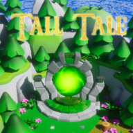

# Tale

『Tall Tale』または『Tale』は、学習目的でUnreal Engine 5を使用して開発されたシングルプレイヤー向けアクションアドベンチャーゲームです。
このゲームの目標は、UE5の多彩な機能を活かし、完全にプレイ可能なゲームを制作することです。
目標を達成可能に保つため、1つのレベルに4体の敵対的なNPCと1人のプレイアブルキャラクターが配置されます。 
 

現在のキーバインドは次のとおりです:
- `WASD` で移動
- `左マウスボタン (LMB)` で攻撃
- `右マウスボタン (RMB)` で防御
- `1` で剣を装備
- `2` で盾を装備
- `E` でオブジェクトとインタラクトし、アイテムを拾う
- `I` でプレイヤーのインベントリを開く
- `R` で回復
- `Escape` で終了

## 適用機能
- [アニメーション モンタージュ](https://dev.epicgames.com/documentation/ja/unreal-engine/animation-montage-in-unreal-engine)
- [Enhanced Input](https://dev.epicgames.com/documentation/ja/unreal-engine/enhanced-input-in-unreal-engine)
- [オーディオ](https://dev.epicgames.com/documentation/ja/unreal-engine/audio-in-unreal-engine-5)
- [ゲームプレイ アビリティ システム](https://dev.epicgames.com/documentation/ja/unreal-engine/gameplay-ability-system-for-unreal-engine)
- [Niagaraの概要](https://dev.epicgames.com/documentation/ja/unreal-engine/overview-of-niagara-effects-for-unreal-engine)
- [ウィジェット ブループリント](https://dev.epicgames.com/documentation/ja/unreal-engine/widget-blueprints-in-umg-for-unreal-engine)

## スクリーンショット

2025年4月22日

## クレジット
このプロジェクトでは、[Fab](https://www.fab.com/channels/unreal-engine)から提供される無料のアート資産と、[Pixabay](https://pixabay.com/sound-effects/)から提供されるサウンドエフェクトを、非商用目的で使用しています。
